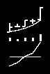
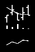
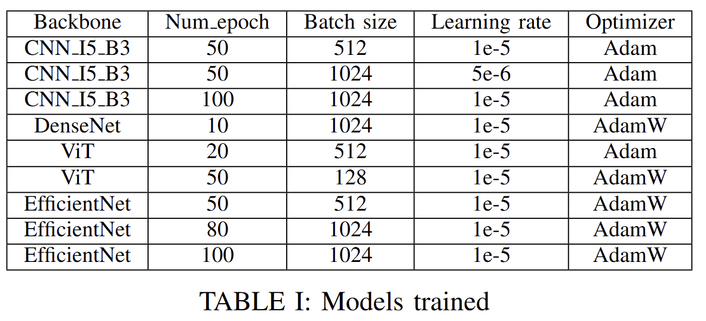
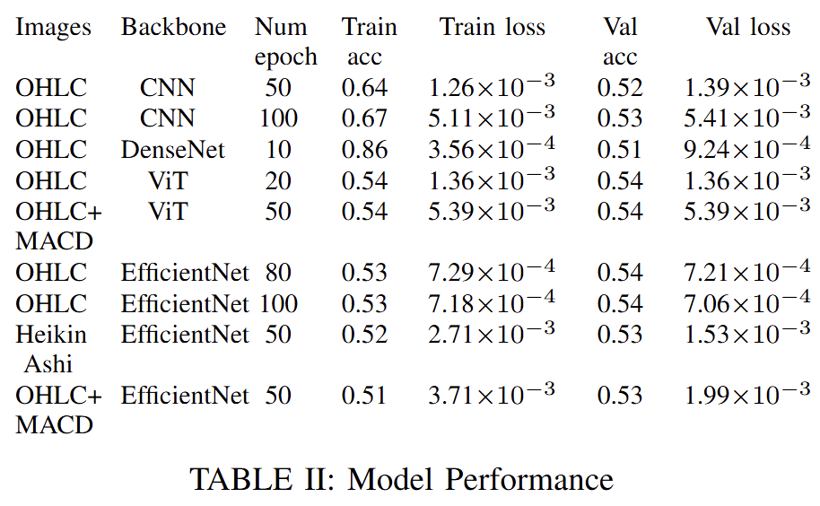

# Algorithmic-Trading-Based-on-Imaging-Price-Trends
This is the project repository for DASC7600 Data Science Project: Algorithmic Trading Based on Imaging Price Trends. 
The model achieves a high annualized return rate and Sharpe Ratio, and can be used in different markets.

The project is greatly inspired by the paper: 

<b>J. JIANG, B. KELLY, and D. XIU, “(re-)imag(in)ing price trends,”
The Journal of Finance, vol. 78, no. 6, pp. 3193–3249, 2023.</b>

<b>Available: https://onlinelibrary.wiley.com/doi/abs/10.1111/jofi.13268</b>

## Introduction

The foundational inspiration for this study stems from
the seminal work, (Re-)Imag(in)ing Price Trends by Jing-
wen Jiang, Bryan Kelly, and Dacheng Xiu. Their research
introduced an innovative methodology of treating stock price
charts as images, allowing convolutional neural networks
(CNNs) to process this visual information directly. By lever-
aging CNNs, their study uncovered intricate return-predictive
patterns that extended beyond traditional market phenomena,
such as momentum and reversal effects.

   
  <em>Result of J. JIANG, B. KELLY, and D. XIU, “(re-)imag(in)ing price trends; MOM,STR,WSTR,TREND are traditional methods</em>

## Main Idea
The project advances the exploration of image-based stock
price prediction by leveraging cutting-edge deep learning
architectures and introducing enhancements to data repre-
sentation. Building upon the work of Jiang et al., we incor-
porate additional technical indicators and adopt optimized
visualization techniques to enrich the feature space available
for predictive modeling. Our approach seeks to maximize the
utility of CNNs and other advanced architectures in capturing
nuanced price patterns for improved return forecasting

## Methodology
In this repository, due to confidentiality reasons, some of the codes are hidden intentionally. All the model weights are not uploaded also.

### Plotting
The following parameters are used for plotting:
- <b>I</b> : Number of days of stock data used / time interval

- <b>R</b> : Number of days after for calculating return / time interval of return

Example: I=5, R=5: 5-days stock chart plot, compare the stock price the in last day with that of 5 days later.
Example: I=5, R=20: 5-days stock chart plot, compare the stock price the in last day with that of 20 days later.

The stocks are represented in OHLC chart in black and white, along with volume bars and a moving average line, as shown below

   
  <em>Example of a 5-day stock image generated</em>

Different chart type and indicators are also added and available.

||||
|:-:|:-:|:-:|
|Heikin Ashi Chart|MACD|RSI|

After plotting, all the images will be classified as Positive and Negative, according to their return R days later.

To plot and classify the images, run

`python plot.py`

There are multiple argument parameters available.
For example, to plot SSEC index stocks from 2001-01-01 to 2005-01-01 with I=20, R=20 and RSI indicator, run

`python plot.py --I 20 --R 20 --start_date 2001-01-01 --end_date 2005-01-01 --indicator RSI`

### Training

The image dataset is splitted with 70% training, 30% validation by default.
The default CNN, DenseNet, EfficientNet and ViT are available for training. Notice that ViT resizes the image into square dimensions. The best model will be saved according to the save path.

To train the images, run
`python train.py`

Similarly, there are multiple argument parameters available.
For example, to train a DenseNet model with batch size of 256, learning rate of 1e-5 for 100 epochs, run

`python plot.py --model DENSENET --batch_size 256 --learning_rate 1e-5 --num_epoch 100`

Retraining a model from a certain `.pt` checkpoint is possible, one will have to specify the `model_path` parameter.

The training result are available below:

   
   

### Backtesting

After training, the models are backtested, with the following two trading strategies
## Results
