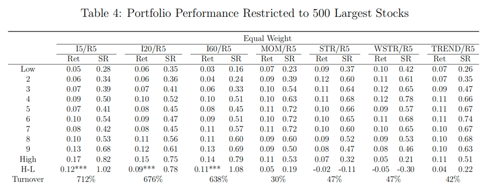

# Algorithmic-Trading-Based-on-Imaging-Price-Trends
This is the project repository for DASC7600 Data Science Project: Algorithmic Trading Based on Imaging Price Trends. 
The model achieves a high annualized return rate and Sharpe Ratio, and can be used in different markets.

The project is greatly inspired by the paper: 

<b>J. JIANG, B. KELLY, and D. XIU, “(re-)imag(in)ing price trends,”
The Journal of Finance, vol. 78, no. 6, pp. 3193–3249, 2023.</b>

<b>Available: https://onlinelibrary.wiley.com/doi/abs/10.1111/jofi.13268</b>

## Introduction

The foundational inspiration for this study stems from
the seminal work, (Re-)Imag(in)ing Price Trends by Jing-
wen Jiang, Bryan Kelly, and Dacheng Xiu. Their research
introduced an innovative methodology of treating stock price
charts as images, allowing convolutional neural networks
(CNNs) to process this visual information directly. By lever-
aging CNNs, their study uncovered intricate return-predictive
patterns that extended beyond traditional market phenomena,
such as momentum and reversal effects.

   
  <em>Result of J. JIANG, B. KELLY, and D. XIU, “(re-)imag(in)ing price trends; MOM,STR,WSTR,TREND are traditional methods</em>

## Main Idea
The project advances the exploration of image-based stock
price prediction by leveraging cutting-edge deep learning
architectures and introducing enhancements to data repre-
sentation. Building upon the work of Jiang et al., we incor-
porate additional technical indicators and adopt optimized
visualization techniques to enrich the feature space available
for predictive modeling. Our approach seeks to maximize the
utility of CNNs and other advanced architectures in capturing
nuanced price patterns for improved return forecasting

## Methodology

### Plotting
The following parameters are used for plotting:
- <b>I</b> : Number of days of stock data used / time interval

- <b>R</b> : Number of days after for calculating return / time interval of return

Example: I=5, R=5: 5-days stock chart plot, compare the stock price the in last day with that of 5 days later.
Example: I=5, R=20: 5-days stock chart plot, compare the stock price the in last day with that of 20 days later.

The stocks are represented in OHLC chart in black and white, along with volume bars and a moving average line, as shown below

   
  <em>Example of a 5-day stock image generated</em>

### Training

### Backtesting

## Results
